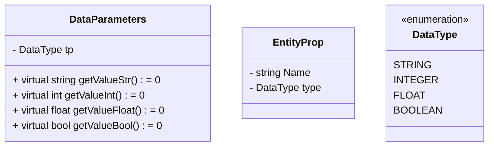
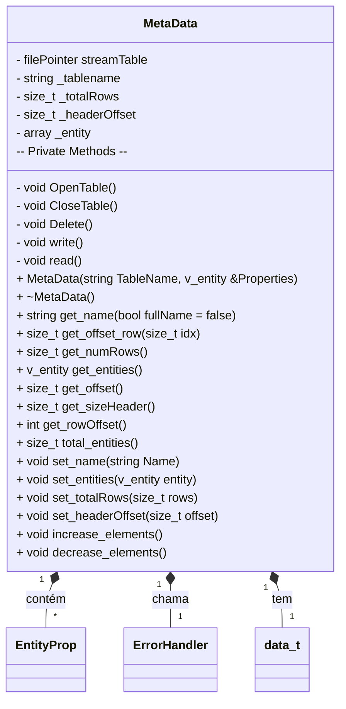

# Implementação de um Interpretador - ScratchQL

Neste projeto, será desenvolvido um projeto de estudo voltado no desenvolvimento da Linguagem SQL. Tal desenvolvimento possui duas frentes de produção: Interpretador e Gerenciamento de Tabelas.

# PASSOS DE DESENVOLVIMENTO
## Gerenciamento de Tabelas

Para Abstrairmos a entrada de diferentes tipos de dados, criamos uma estrutura fixa de entradas possíveis para uso na sua entrada, especificada com enumeração como `DataType`. Nele, limitamos os tipos de dados a serem trabalhados.

Em suma:
- `DataParameters`: classe para leitura do dado de forma correta
- `EntityProp`: Propriedades da Entidade
- `DataType`: Tipo de Dados(STRING, INT, DATA, FLOAT, BOOL)
   

Para manipulação dos Arquivos: MetaData. Sua função é integrar o arquivo físico e a tabela. 
Nesta organização, temos muito oque melhorar: uso de Hash, pesquisa de dados e outros BTree..

## INTERPRETADOR - S~~crath~~QL

Esta etapa é feita em conjunto com a criação do gerenciador de tabelas. Nele, temos a chamada e criação de arquivos de tabelas para gerir todo o sistema. 

Na imagem, temos a síntese de todas as _keywords_ da Linguagem SQL. Para este exemplo, estamos desenvolvendo apenas a ponta do Iceberg - por isso, ScratchQL - a fim de entender os conceitos de organização de dados, bem como o desenvolvimento de um Interpretador.

## REFERENCIAS BIBLIOGRAFICAS
