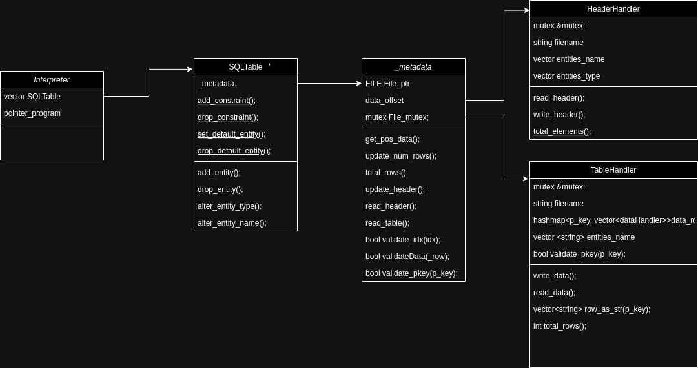
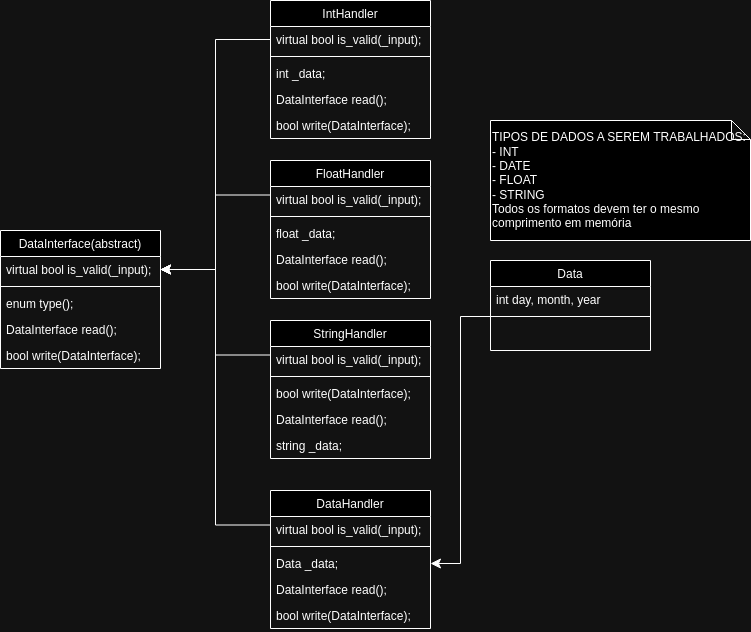

# SimpleQL Schematic

In this project, we're aiming to apply many concepts about  Information Recover and Organization with a Project. Such aspects relates do SQL for such, which will be divided in two dev fronts: Interpreter and SQLTableManager, which deals with user inputs as text or even command line and a Handler for multiple tables that are created, updated and deleted. 
For such implementation, I developed a simple class organization for such: 

 

And the data Structure
 

## Next Steps

<!-- ### Ideas for _TableHandler_
1. A Class to File(making it more easier to read/write rows and collumns with the same pointer)[FileHandler]

2. A structure to deal with primary/secondary/n-ary keys, and TableHandler just intermediate the situation.
3. **Develop _delete_ after search is done.**
3. Busca pela chave primária (CPF)
4. Busca por chave secundaria - CIDADE por exemplo. 
    - implementa no começo sequencial.
5. Implenentação de Inserção/Remoção - logica e fisica.

 -->

Here are some brainstorming ideas for the project, focusing on organizing all the data and addressing class implementation issues.

|IMPLEMENTED ?| Unit-Tested ? | Descr.|
|-|-|-|
|✅| -| Binary Scheme Organization to read/write file|
|❌| -| **(just an idea)** mutex to control and manage file registry|
|❌|❌| DataInterface Operations(+,++,-, --, *, / and others)|
|✅|✅| DataInterface class and its abstractions|
|✅|✅| HeaderHandler class |
|✅|❌| TableHandler class**|

<!-- ✅ -->
<!-- ❌ -->

** I could do an data structure related to Threes and List/Vectorized. This idea allows me to improve from both sides: search and inclusion/exclusion. With this, data selection/filtering becomes fast and pratical. However, how should I do it ? 